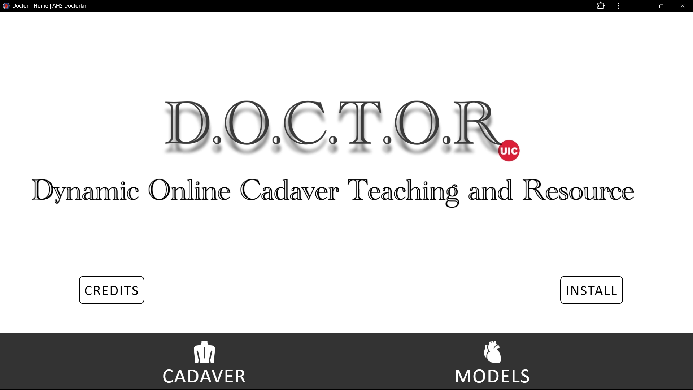
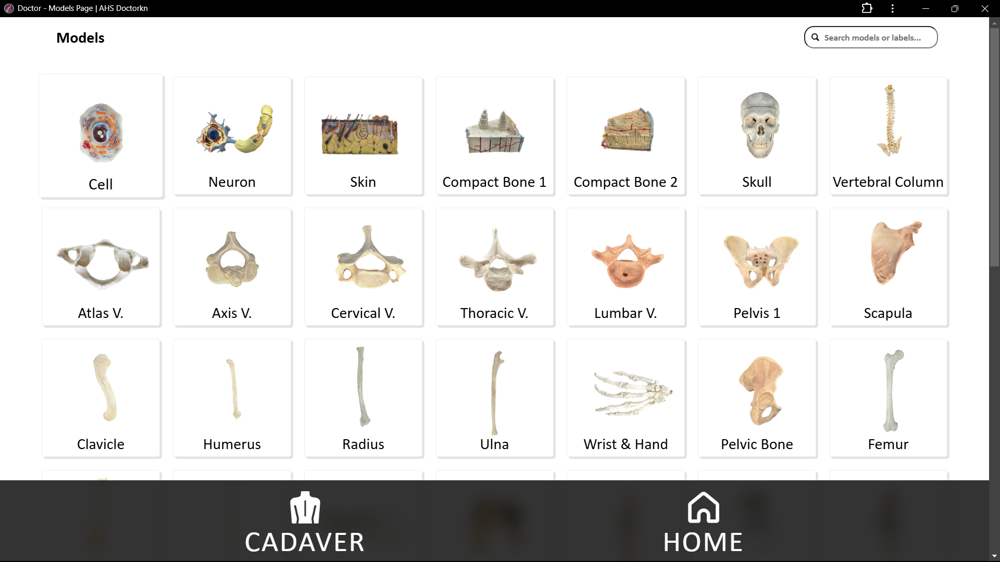
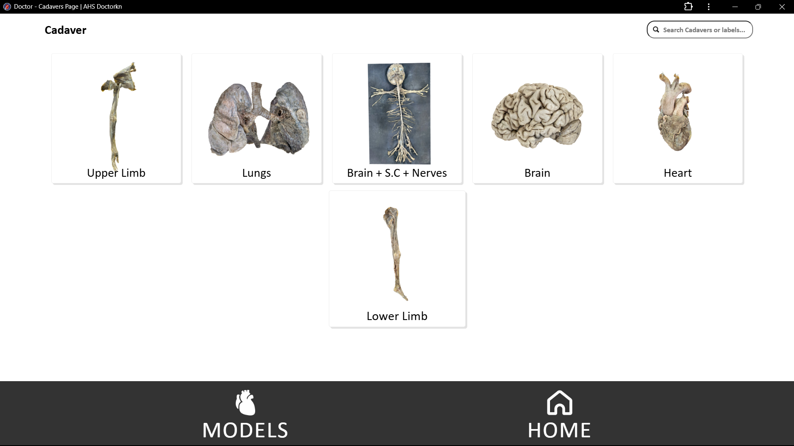
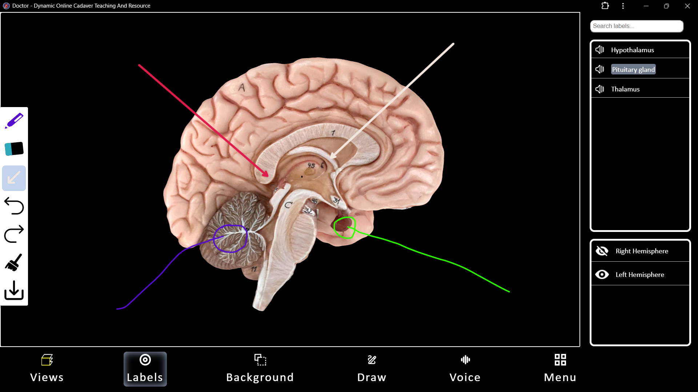

# D.O.C.T.O.R
Dynamic Online Cadaver Teaching and Resource

# Software Engineer | University of Illinois Chicago (UIC)
**Duration:** January 2024 – Present  
**Location:** Chicago, Illinois, USA  

## Overview  
DOCTOR is an anatomical lab suite 3D Web application for the students and professors of the University of Illinois Chicago, where you can choose from a wide range of 3d models and 3d cadaver models to explore and learn from. It is solely intended for the users to have a real cadaver lab experience wherever they are. DOCTOR comes with many cool and interesting features like animations, Views, Draw, Voice input, Label search, Hide and Unhide parts, and their differentiation, and many more. All of these keeping in mind to make the user not overwhelmed with all fancy features but just what they want and easy to navigate layouts and differentiation between Plastic Models and Cadaver Models.

---
## Purpose

The purpose of this project is to:
1. Make it available for Students to take their virtual Cadavers and Models home for better study.
2. Keep the design and Layouts as simple and basic as possible to not overwhelm the users.
3. Provide students the ability to pronounce certain words and also help them hear how it sounds exactly .
## Technologies Used  
- **Languages:** JavaScript, HTML, CSS, Python  
- **Frameworks:** Three.js, Node.js, React.js, OpenCV 
- **Databases:** MongoDB  
- **Tools:** Linux, REST APIs, MeshMixer, Blender(3d Software), Photogrammetry
- **Techniques:** Lazy Loading, Asynchronous Programming, SSO Integration.

# Features
## 1. **Interactive 3D Model Viewer**  
   - Allows users to select between  **Models or Cadavers**.
   - Allows Professors to upload different 3d models and tag them for students to access.
   - 3D models can have multiple Layers to hide and unhide. 
   - Allows users to **explore, rotate, zoom, and interact** with detailed 3D anatomical models.  
   - Built using **Three.js** for rendering high-quality visuals and ensuring smooth performance.
         
         
## 2. **Drawing and Annotation**  
   - Users can **draw** on the 3D models using different tools like **Pen**, **Arrow**, **Eraser**, **Undo**, **Redo**, **Save** the drawing.  
   - Authorized users (e.g., faculty) can edit and manage annotations.  
   - Students have **view-only access** to maintain security and integrity of the data.
      
## 3. **Voice Search and Input**  
   - Implemented **voice input** to allow hands-free navigation for Labels.  
   - Users can **search for anatomical regions**, **labels** or **Views** using speech commands.  
   - Enhances accessibility and ease of use for students and faculty.  

## 4. **Search Functionality**  
   - Integrated a **search bar** that allows users to find 3d models in Models Page and Cadavers Page seperately for ease of access.
   - **Search bar** inside Model Viewing Engine allows users to quickly locate and highlight anatomical regions and labels.  
   - Supports both text and voice-based searches for seamless navigation.  

## 5. **Lazy Loading for Optimized Performance**  
   - Models and data are loaded **asynchronously** to reduce initial load times.  
   - Performance optimized to load 3D models **40% faster** using **lazy loading** and asynchronous calls.  

## 6. **Secure Single Sign-On (SSO)**  
   - Implemented **SSO authentication** for secure access.  
   - Ensures only authorized students and faculty members can log in to the application.  

## 7. **Upload and Edit Functionalities**  
   - Faculty and authorized users can:  
      - **Upload new 3D models.**  
      - **Add, edit, and manage annotations** on existing models.  
   - A secure workflow ensures version control and data safety.  

## 8. **Responsive Design**  
   - The app is fully responsive and works seamlessly on **desktops, tablets, and mobile devices**.  
   - Built using **HTML, CSS, and JavaScript** for cross-device compatibility.  

## 9. **Data Storage and Retrieval**  
   - Integrated **MongoDB** to securely store and manage model metadata, labels, and annotations.  
   - Enabled **RESTful APIs** for efficient data access and retrieval.  

## 10. **Robust Deployment**  
   - Deployed on **UIC servers** with strong performance optimization and monitoring.  
   - Ensures reliability and scalability to serve thousands of users.

## Project Impact  
This application empowered over **2,000+ active users** as per (Google Analytics) with advanced tools for exploring, annotating, and interacting with anatomical models. It significantly improved the educational experience by enhancing accessibility, performance, and security.

